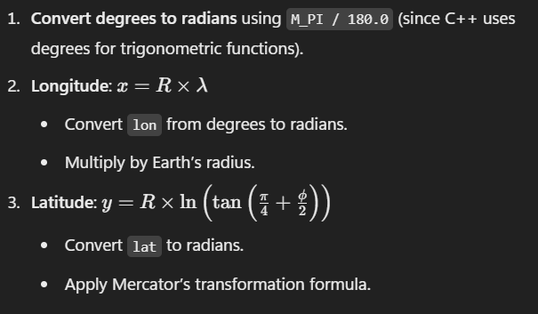

## TODO

- Load locally the database (Done)
- Take a paper and a pencil, by a,analysing the privious pratical work, draw how to mecanic of the project, in order to understand clearly the 
espectations. Then based on your understanding, design a step-by-step path I should follow in order to complete the project successfully. (Done)
- Create the MVC of Graph, SceneCarte (Done)
- Create the project's roadMap. (Done)
- Implement the Graph's class (Done)
- Implement 
- Find issues in the shortestPath algorithm
- Add comment to Graph class and to its methods

1. Create the relationship between waypoints based on the shortest distance between two.
`
waypointList = []
adjacencyList = {}
minDist = float("inf")
for A in waypointList:
    for B in waypointList:
        if A.getNom() != B.getNom():
           adjacencyList.get(A, [])

        currDist = getDistance(A, B)

        if currDist < minDist:
           neighbour = B
           minDist = currDist
    A.append(B)     
`

## Python Code to generate visuale Graph with relations
```py
import networkx as nx
import matplotlib.pyplot as plt

# Read edges from a text file
filename = "closestMapOutput.txt"

G = nx.Graph()
edges = []
with open(filename, "r") as file:
    for line in file:
        node1, node2 = map(str.strip, line.split(","))
        edges.append((node1, node2))

# Define edges based on input

# Create a graph
G = nx.Graph()
G.add_edges_from(edges)

# Draw the graph
plt.figure(figsize=(12, 9))
nx.draw(G, with_labels=True, node_color="lightblue", edge_color="black", node_size=80, font_size=0)
plt.show()
```

## Notes
In graph class, to convert the latitude and longitude into (x, y) coords, I will use the `Mercator projection`.



---

My first approch was implement a complete graph, which means all nodes are connected together. This graph representation give us the shortest path between A -> B is [A, B]. Because there is not checkpoint between both.
So deal with that and have the espected result!, I have to implement a sparse graph.
- A sparse graph is a type of graph in which the number of edges is significantly less than the maximum number of possible edges

- To implement a *sparse graph*, I have to change in my code the create adjacencyList(). By define connections between waypoints explicitly, or use some
criteria like (MaxDistance) to determine neighbors.
NB: *MaxDistance*: as a create criteria play a big role in path's *precision*. 
After testing, I find that the best value of the maxDistance is: 


## Issues
-  In the `getShorestestPath()` method, finding the shorestest path between two waypoints (src, dest) return the [src, dest] as the shortest.
The implemented algorithm is all corrects. But the problem is locate in the `createWeightedAdjacencyList()` methods. In the current algorithm, the 
weight are the distance between two waypoints. So when I execute the code, it return me [src, dest] as the shortest distance. 
To solve the issue and a list containing more than 2 waypoints, I have to correctly assign the weight.

This method create a fully connected Graph, making every location a direct neighbor of every other. This leads to direct connections being considered the 
shortest path, even when indirect path should be better.

To solve the issue, I will only closest neighbors instead of full connection.
I have to design an indirect graph.

```cpp
import networkx as nx
import matplotlib.pyplot as plt

def read_graph_from_file(filename):
    G = nx.Graph()  # Create an undirected graph
    with open(filename, 'r') as f:
        for line in f:
            # Strip any leading/trailing whitespace and split by commas
            nodes = line.strip().split(', ')
            if len(nodes) == 2:
                # Add an edge between two nodes
                G.add_edge(nodes[0], nodes[1])
    return G

def visualize_graph(G):
    # Draw the graph with a spring layout (you can use other layouts like circular, shell, etc.)
    plt.figure(figsize=(12, 12))
    nx.draw(G, with_labels=True, node_size=500, node_color='skyblue', font_size=4, font_weight='bold', edge_color='gray')
    plt.title("Graph Visualization")
    plt.show()

# Replace 'graph.txt' with the path to your graph file
filename = 'edgeList.txt'

# Read the graph from the file and visualize it
G = read_graph_from_file(filename)
visualize_graph(G)
```


## Thinking
Q: How to convert (lat, long) into (x, y) ?
R: By using the Mercator projection.

Q: How to get the neighbours of a waypoint knowing that their are not positionned horizontally or vertically or diagonally.
R: I can use bresenham algorithm.
Bresenham algorithm will be allow me to find a neighbour point by drawing a segment from the given waypoint to a waypoint in the map. If the segment exist, the first waypoint countered on the segment is a neighbour.

I can create add a functionnality on the choose the precision of the path.

# Short course about Graphs
```
### 1. **Weighted Graph**  
   - Each edge has a weight representing the **distance, time, or cost** to travel between two locations.
   - Used in **Google Maps, GPS systems, and transportation networks**.

### 2. **Directed Graph (Digraph) or Undirected Graph**
   - **Directed Graph:** If roads are **one-way streets**, edges have a direction.
   - **Undirected Graph:** If roads allow travel in both directions, edges are bidirectional.

### 3. **Sparse or Dense Graph**
   - **Sparse Graph:** If there are only a few direct connections (e.g., rural areas).
   - **Dense Graph:** If most locations are connected (e.g., urban cities).

### 4. **Graph Algorithms for Shortest Path**
   - **Dijkstra’s Algorithm** → Best for **finding the shortest path with positive weights**.
   - **A* (A-Star) Algorithm** → Uses heuristics for **faster pathfinding**.
   - **Bellman-Ford Algorithm** → Handles **negative weights** but slower.
```

# About the Graph class
- `findShortestPath()` : return to me a list of in representing indeces of a waypoints.
- Do be able to visualize a graph, I implement the `adjacencyList` into `edgeList` and store the output in a .txt file, which will be used in a python code to visualize the graph.